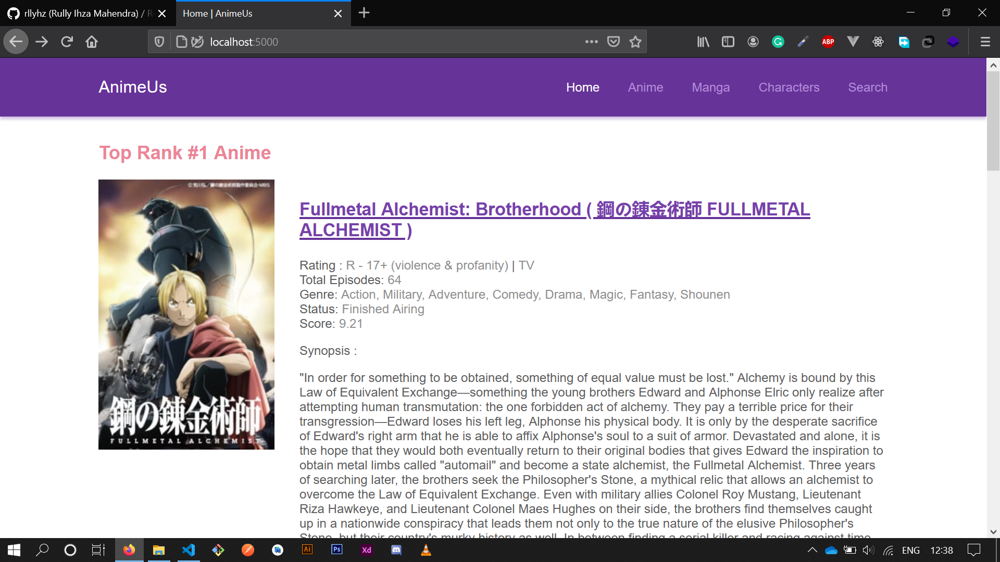
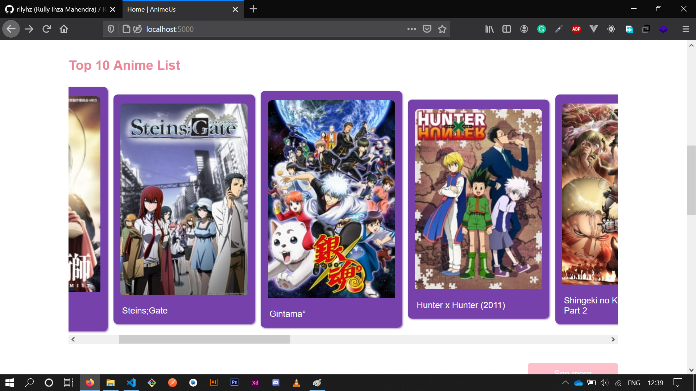
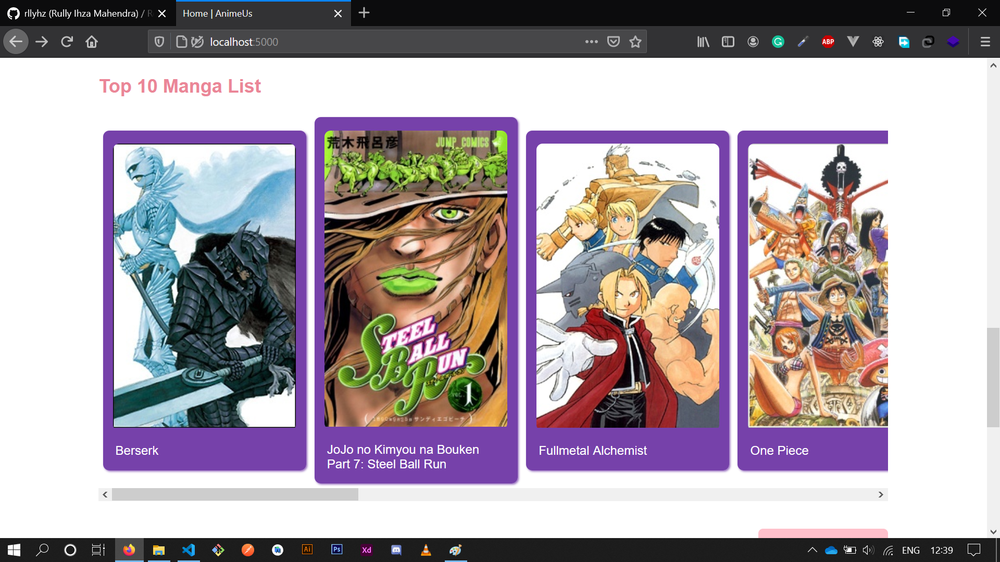
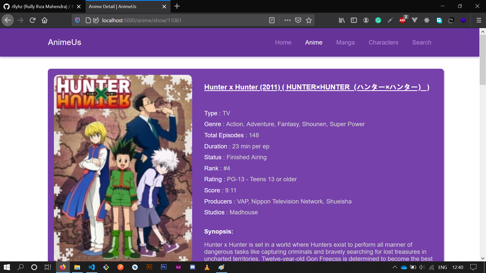
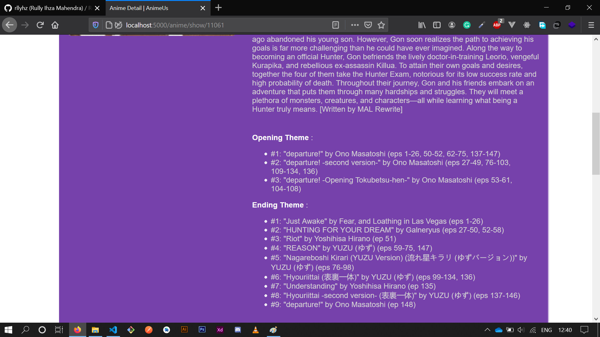
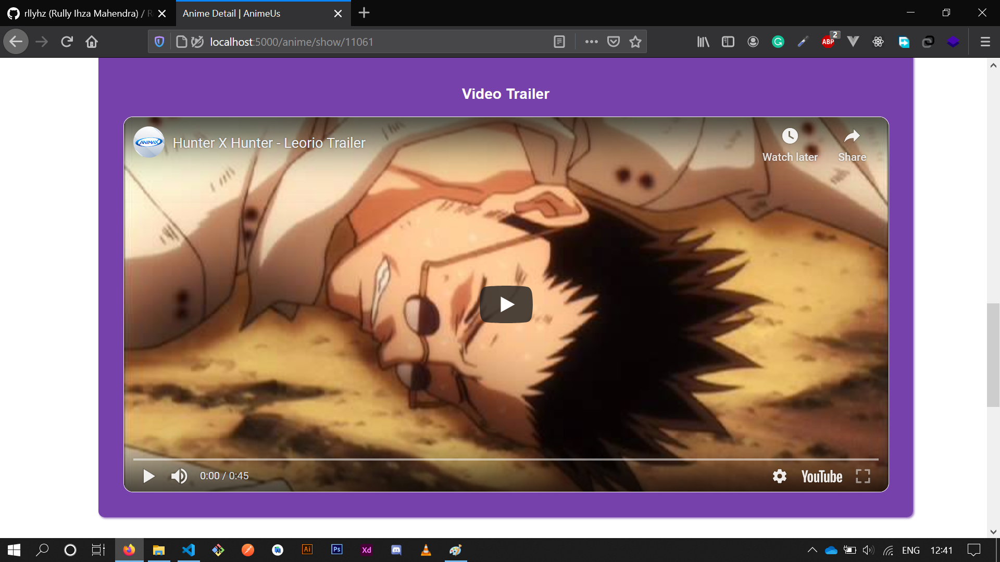

# **AnimeUs Responsive Web**

WebApp that provides some information of Anime, Manga, Characters.

This web uses an unofficial MyAnimeList API in order to provide some information. [This api](https://api.jikan.moe/v3) was created by [`Jikan`](https://github.com/jikan-me/jikan). Here's the link if you want to use it as well :

> [`https://api.jikan.moe/v3`](https://api.jikan.moe/v3)

## Preview Video

<iframe src="previews/preview.mkv" width="100%" height="350px"></iframe>
<video src="previews/preview.mkv">
 <source>
</video>

 

## Home Page

 

## Anime Page

  

### Thanks

Please follow me on sosial media if you feel interested in something like this:

| Sosial Media | Links |
| ------------ | ----- |
| Instagram | [https://instagram.com/rllyhz](https://instagram.com/rllyhz) |
| Twitter | [https://twitter.com/rullyihza_](https://twitter.com/rullyihza_) |
| Facebook | [https://facebook.com/rully.ihza](https://facebook.com/rully.ihza) |