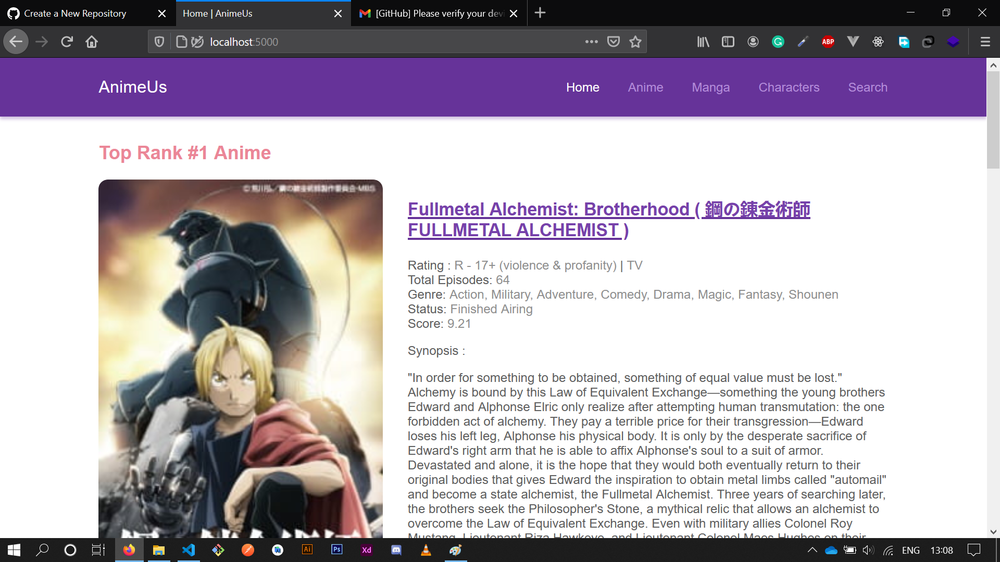

# **AnimeUs Responsive Web**

WebApp that provides some information of Anime, Manga, Characters. Front-end side of the app was built using only pure [`HTML`](https://www.w3.org/), [`SCSS (Css Preprocessor)`](https://sass-lang.com/documentation/syntax), and [`Javascript`](https://developer.mozilla.org/en-US/docs/Web/javascript) language. Besides, The back-end side was built in using [`nodejs`](https://nodejs.org/en/) and [`express`](http://expressjs.com/) library to serve the web server.

### Features

- Show Anime list
- Show Manga list
- Show Characters list
- Show Top Anime and Manga list
- Detail description of each Anime and Manga

This web uses an unofficial MyAnimeList API in order to provide some information. [This api](https://api.jikan.moe/v3) was created by [`Jikan`](https://github.com/jikan-me/jikan). Here's the link if you want to use it as well :

> Official Doc :  [`https://jikan.moe/`](https://jikan.moe/)

> Base url of API :  [`https://api.jikan.moe/v3`](https://api.jikan.moe/v3)

 

## Preview Video

 

## Home Page

 

## Anime Page

  

### Thanks

Please follow me on sosial media if you feel interested in something like this:

| Sosial Media | Links |
| ------------ | ----- |
| Instagram | [https://instagram.com/rllyhz](https://instagram.com/rllyhz) |
| Twitter | [https://twitter.com/rullyihza_](https://twitter.com/rullyihza_) |
| Facebook | [https://facebook.com/rully.ihza](https://facebook.com/rully.ihza) |